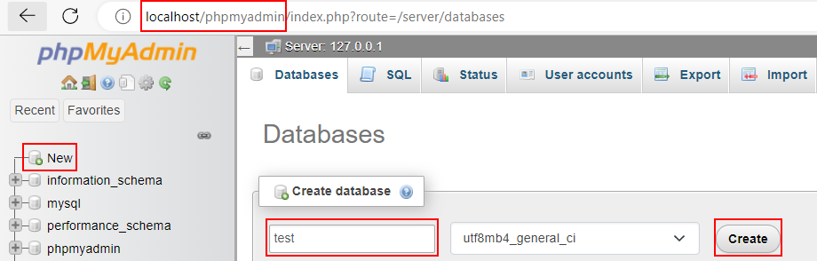
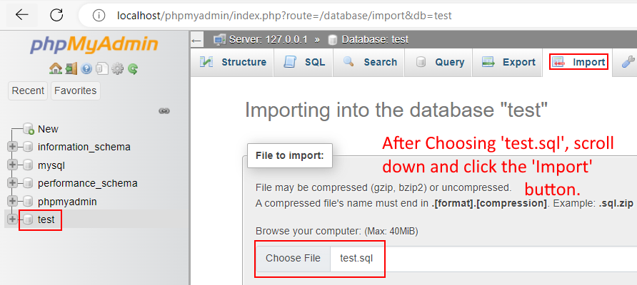

# CSCE310
# Note: Each person needs to use an index and use a view
Guide:

- Make sure to put this folder in the httdocs folder of your XAAMP Installation. Make sure to activate Apache and MySQL in XAAMP. Next, go to localhost/phpymyadmin. Then follow the next two steps:

- Click on the left side to make a new database called `test`.



- Make sure to then import `test.sql`.



```